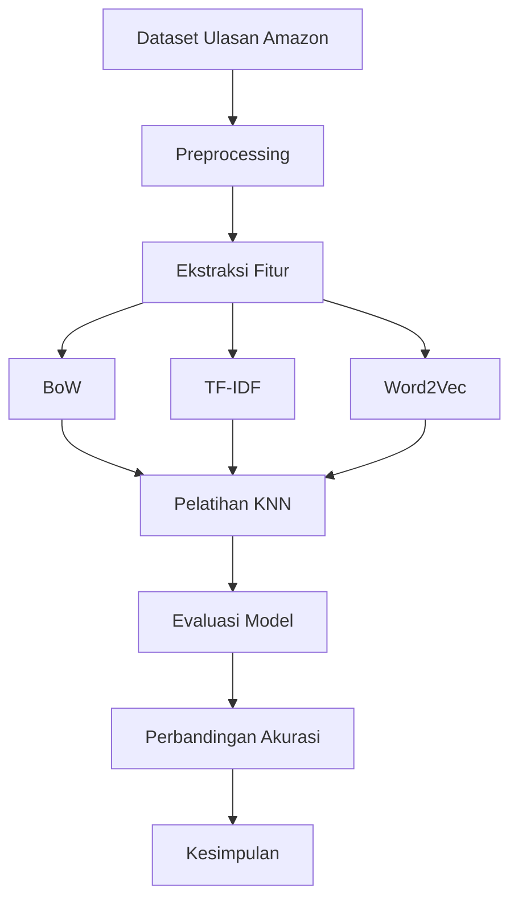

# Analisis Sentimen Ulasan Amazon Menggunakan K-Nearest Neighbors (KNN) dengan Berbagai Metode Ekstraksi Fitur: BoW, TF-IDF, dan Word2Vec

> **Daniel Kristian Jatmiko**
> **A11.2021.13429**


---
# 2. 
#### **Ringkasan Project**  
Proyek ini bertujuan untuk melakukan **Analisis Sentimen** pada ulasan produk Amazon menggunakan model **K-Nearest Neighbors (KNN)** dengan tiga metode ekstraksi fitur yang berbeda:  
1. **Bag of Words (BoW)**  
2. **TF-IDF**  
3. **Word2Vec**  

Dataset terdiri dari ulasan berlabel sentimen (positif = 2, negatif = 1) yang diproses melalui tahapan preprocessing seperti lowercasing, tokenisasi, penghapusan stopwords, dan stemming. Performa ketiga metode dievaluasi berdasarkan akurasi, precision, recall, dan confusion matrix.

#### **Permasalahan**  
1. **Data teks tidak terstruktur** memerlukan ekstraksi fitur yang efektif untuk representasi numerik.  
2. **Ketidakseimbangan fitur** antara metode BoW/TF-IDF (sparse matrix) dan Word2Vec (dense vector) memengaruhi kinerja model.  
3. **Akurasi model bervariasi** tergantung pada metode ekstraksi fitur yang digunakan.  

#### **Tujuan**  
1. Membandingkan performa **KNN** dengan tiga teknik ekstraksi fitur.  
2. Menentukan metode terbaik untuk klasifikasi sentimen ulasan Amazon.  
3. Meningkatkan pemahaman tentang kelebihan dan kelemahan BoW, TF-IDF, dan Word2Vec.  

#### **Model/Alur Penyelesaian (Bagan)**  



##### **Penjelasan Bagan:**  
1. **Preprocessing**:  
    - Lowercasing, tokenisasi, penghapusan stopwords, dan stemming.  
2. **Ekstraksi Fitur**:  
    - **BoW**: Hitungan frekuensi kata.  
    - **TF-IDF**: Pembobotan kata berdasarkan importance.  
    - **Word2Vec**: Embedding kata ke vektor 250 dimensi.  
3. **Pelatihan KNN**:  
    - Model KNN (k=5) dilatih untuk setiap representasi fitur.  
4. **Evaluasi**:  
    - Akurasi, classification report, dan confusion matrix.  
5. **Hasil**:  
    - Word2Vec memberikan akurasi tertinggi (**78.96%**), diikuti TF-IDF (**67.64%**) dan BoW (**65.91%**).  


---
# 3. 

### **Penjelasan Dataset**  
Dataset yang digunakan berasal dari **Kaggle**: [Amazon Product Reviews](https://www.kaggle.com/datasets/kritanjalijain/amazon-reviews/).  

###### **Variabel Utama**:  
1. **Polarity**: Label sentimen (`1` = negatif, `2` = positif).  
2. **Title**: Judul ulasan.  
3. **Text**: Isi ulasan produk.  

#### **Karakteristik Dataset**:  
- Format: CSV (terdiri dari file `train.csv` dan `test.csv`).  
- Ukuran:  
	- Training data: ~3.6 juta ulasan (disampling jadi **100.000** untuk efisiensi).  
	- Testing data: ~400.000 ulasan (disampling jadi **50.000**).  
- Bahasa: Inggris.  

### **Exploratory Data Analysis (EDA)**

1. **Distribusi Label**:
    - Data latih dan uji memiliki distribusi label yang seimbang (±50% positif dan negatif).
    - Contoh: Pada data uji, terdapat 25,028 negatif dan 24,972 positif.
2. **Panjang Teks**:
    - Rata-rata panjang karakter ulasan bervariasi, dengan beberapa ulasan sangat pendek (contoh: "CRAP") atau panjang.
    - Preprocessing menggabungkan `title` dan `text` untuk memperkaya konteks.
3. **Kata Umum**:
    - Setelah penghapusan stopwords dan stemming, kata seperti "product", "movi", "book" sering muncul.
    - Kata spesifik seperti "disappoint" (negatif) atau "love" (positif) menjadi fitur penting.


---
# 4. 

### **Proses Learning/Modeling dalam Analisis Sentimen dengan KNN**  

Proses ini melibatkan pelatihan model **K-Nearest Neighbors (KNN)** menggunakan tiga representasi fitur berbeda (**BoW, TF-IDF, Word2Vec**). Berikut penjelasan rinci setiap tahapannya:

##### **1. Persiapan Data**  
- **Pemisahan Fitur-Target**:  
  ```python
  X_train = df_train["clean_text"]  # Fitur: teks yang sudah diproses
  y_train = df_train["polarity"]    # Target: label sentimen (1/2)
  X_test = df_test["clean_text"]
  y_test = df_test["polarity"]
  ```

##### **2. Pelatihan Model KNN**  
Model KNN dilatih dengan parameter default (`n_neighbors=5`) untuk setiap representasi fitur:  

###### **a. KNN dengan BoW**  
- **Konversi Teks ke Matriks BoW**:  
  ```python
  bow_vectorizer = CountVectorizer()
  X_train_bow = bow_vectorizer.fit_transform(X_train)  # Matriks sparse
  X_test_bow = bow_vectorizer.transform(X_test)
  ```
- **Pelatihan & Prediksi**:  
  ```python
  knn_bow = KNeighborsClassifier()
  knn_bow.fit(X_train_bow, y_train)
  y_pred_bow = knn_bow.predict(X_test_bow)
  ```
- **Hasil**:  
    - Akurasi: **65.91%**  
    - Confusion Matrix menunjukkan klasifikasi seimbang antara positif dan negatif.  

###### **b. KNN dengan TF-IDF**  
- **Pembobotan TF-IDF**:  
  ```python
  tfidf_vectorizer = TfidfVectorizer()
  X_train_tfidf = tfidf_vectorizer.fit_transform(X_train)
  X_test_tfidf = tfidf_vectorizer.transform(X_test)
  ```
- **Pelatihan & Prediksi**:  
  ```python
  knn_tfidf = KNeighborsClassifier()
  knn_tfidf.fit(X_train_tfidf, y_train)
  y_pred_tfidf = knn_tfidf.predict(X_test_tfidf)
  ```
- **Hasil**:  
    - Akurasi: **67.64%** (lebih baik dari BoW karena bobot kata lebih informatif).  

###### **c. KNN dengan Word2Vec**  
- **Pembuatan Embedding**:  
  ```python
  # Latih model Word2Vec
  word2vec_model = Word2Vec(sentences, vector_size=250, min_count=1)
  
  # Konversi teks ke vektor dokumen (rata-rata vektor kata)
  X_train_word2vec = np.array([get_document_embedding(text, word2vec_model) for text in X_train])
  X_test_word2vec = np.array([get_document_embedding(text, word2vec_model) for text in X_test])
  ```
- **Pelatihan & Prediksi**:  
  ```python
  knn_word2vec = KNeighborsClassifier()
  knn_word2vec.fit(X_train_word2vec, y_train)
  y_pred_word2vec = knn_word2vec.predict(X_test_word2vec)
  ```
- **Hasil**:  
    - Akurasi: **78.96%** (terbaik karena vektor menangkap makna semantik).  

##### **3. Evaluasi Model**  
Setiap model dievaluasi menggunakan:  
- **Classification Report** (precision, recall, F1-score).  
- **Confusion Matrix** (visualisasi kesalahan klasifikasi).  
- **Perbandingan Akurasi** antar metode.  


---
# 5.
### **Performa Model KNN pada Analisis Sentimen**  
Berikut adalah evaluasi performa model **K-Nearest Neighbors (KNN)** dengan tiga metode ekstraksi fitur (**BoW, TF-IDF, Word2Vec**) pada dataset ulasan Amazon:

#### **Ringkasan Performa**  
| Metode       | Akurasi    | Precision (Rata-rata) | Recall (Rata-rata) | F1-Score (Rata-rata) | Waktu Pelatihan   |
| ------------ | ---------- | --------------------- | ------------------ | -------------------- | ----------------- |
| **BoW**      | 65.91%     | 0.66                  | 0.66               | 0.66                 | Cepat (~5 detik)  |
| **TF-IDF**   | 67.64%     | 0.68                  | 0.68               | 0.68                 | Sedang (~6 detik) |
| **Word2Vec** | **78.96%** | **0.79**              | **0.79**           | **0.79**             | Lama (~54 detik)  |

#### **Detail Evaluasi**  
##### **a. KNN dengan BoW**  
- **Confusion Matrix**:  
  ```
  [[17245  7783]  
   [ 9287 15685]]  
  ```  
    - **False Positive (FP)**: 7,783 (prediksi positif padahal negatif).  
    - **False Negative (FN)**: 9,287 (prediksi negatif padahal positif).  
- **Kesimpulan**:  
    - Performa seimbang antara kelas positif dan negatif, tetapi akurasi terendah karena representasi fitur kurang informatif.  

##### **b. KNN dengan TF-IDF**  
- **Confusion Matrix**:  
  ```
  [[15448  9580]  
   [ 6660 18312]]  
  ```  
    - **Recall Kelas 2 (Positif) lebih tinggi**: Model lebih baik mendeteksi sentimen positif.  
- **Kesimpulan**:  
    - TF-IDF meningkatkan akurasi 2% dibanding BoW berkat pembobotan kata yang lebih cerdas.  

##### **c. KNN dengan Word2Vec**  
- **Confusion Matrix**:  
  ```
  [[19731  5297]  
   [ 5310 19662]]  
  ```  
    - **False Positive & False Negative terendah**: Kesalahan klasifikasi berkurang signifikan.  
- **Kesimpulan**:  
    - Akurasi melonjak **11%** dibanding TF-IDF karena vektor Word2Vec menangkap makna semantik kata.  

#### **Kelebihan dan Kelemahan Setiap Metode**  

| Metode       | Kelebihan                        | Kelemahan                                |
| ------------ | -------------------------------- | ---------------------------------------- |
| **BoW**      | - Sederhana dan cepat.           | - Abaikan konteks dan urutan kata.       |
| **TF-IDF**   | - Pertimbangkan pentingnya kata. | - Tetap tidak tangkap hubungan semantik. |
| **Word2Vec** | - Tangkap makna kata (semantik). | - Butuh sumber daya komputasi tinggi.    |


---
# 6.
### **Diskusi Hasil dan Kesimpulan**  

##### **Diskusi Hasil**  
Berikut adalah analisis mendalam dari hasil eksperimen **KNN** dengan tiga metode ekstraksi fitur (**BoW, TF-IDF, Word2Vec**) pada dataset ulasan Amazon:  

- **Word2Vec Mendominasi**:  
    - **Akurasi 78.96%** menunjukkan bahwa representasi vektor dari Word2Vec mampu menangkap hubungan semantik antar kata dengan baik.  
    - Contoh: Kata seperti *"excellent"* dan *"awesome"* memiliki vektor serupa, membantu model memahami konteks positif/negatif.  
    - **Confusion Matrix** menunjukkan kesalahan klasifikasi paling rendah (FP/FN ~5,300), menandakan konsistensi prediksi.  

- **TF-IDF Lebih Baik dari BoW**:  
    - **Akurasi 67.64% vs 65.91%** karena TF-IDF memberi bobot lebih pada kata kunci (misal: *"disappoint"* bobotnya tinggi di ulasan negatif).  
    - Namun, masih kalah dari Word2Vec karena tidak memahami sinonim (misal: *"bad"* dan *"terrible"* dianggap berbeda).  

- **BoW Performa Terendah**:  
    - **Akurasi 65.91%** disebabkan oleh representasi fitur yang terlalu sederhana (hanya hitungan kata).  
    - Matriks sparse (banyak nilai 0) membuat KNN kesulitan menemukan pola.  

**Mengapa KNN dengan Word2Vec Sukses?**  
- **Dense Vector**: Vektor 250D dari Word2Vec lebih informatif dibanding matriks sparse BoW/TF-IDF.  
- **Semantic Similarity**: KNN memanfaatkan jarak antar vektor (misal: *cosine similarity*) untuk klasifikasi, cocok dengan embedding semantik.  

**Kendala yang Ditemui**:  
- **Komputasi Word2Vec Lama**: Pelatihan embedding + prediksi KNN memakan waktu >1 menit untuk 50K data uji.  
- **KNN Tidak Scalable**: Tidak cocok untuk dataset sangat besar karena menghitung jarak ke semua sampel latih.  

##### **Kesimpulan**  
Berdasarkan eksperimen, dapat disimpulkan:  
1. **Word2Vec + KNN adalah pilihan terbaik** untuk analisis sentimen ini, dengan akurasi **78.96%**.  
2. **TF-IDF lebih baik daripada BoW**, tetapi masih kalah signifikan dibanding Word2Vec.  
3. **KNN sederhana namun efektif** untuk dataset ukuran sedang, terutama dengan fitur embedding.
